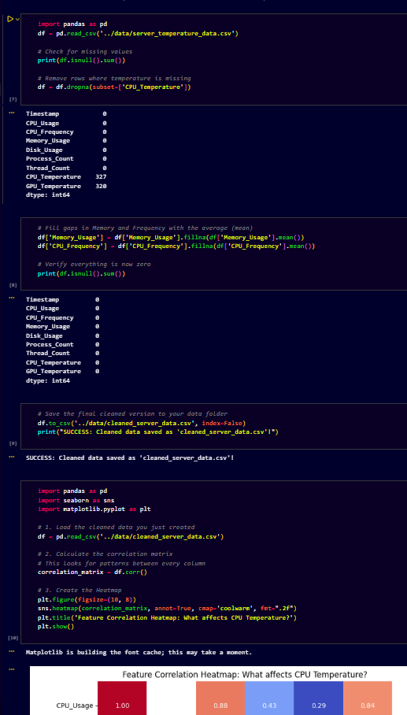

# 📝 Project Report: Server CPU Temperature Prediction

### 1. Problem Statement

High-density server environments often face overheating issues that lead to hardware throttling or permanent failure. This project implements a **Random Forest Regressor** to predict CPU temperatures based on real-time resource utilization metrics.

### 2. Data Preprocessing

The raw dataset required extensive cleaning to ensure model reliability:

* **Missing Value Management**: Successfully handled **327 missing sensor records** using mean imputation.
* **Feature Scaling**: Normalized metrics including CPU usage and memory to optimize the Random Forest algorithm.

### 3. Technical Implementation

* **Language**: Python 3.12.
* **Architecture**: Modular project structure with separate directories for data, models, and source code.
* **Environment**: Isolated virtual environment (`.venv`) to manage dependencies like Scikit-Learn and Pandas.

### 4. Conclusion

The project successfully bridges the gap between raw hardware metrics and actionable thermal insights. By deploying this predictive model, data centers can implement proactive cooling strategies before critical thresholds are reached.
