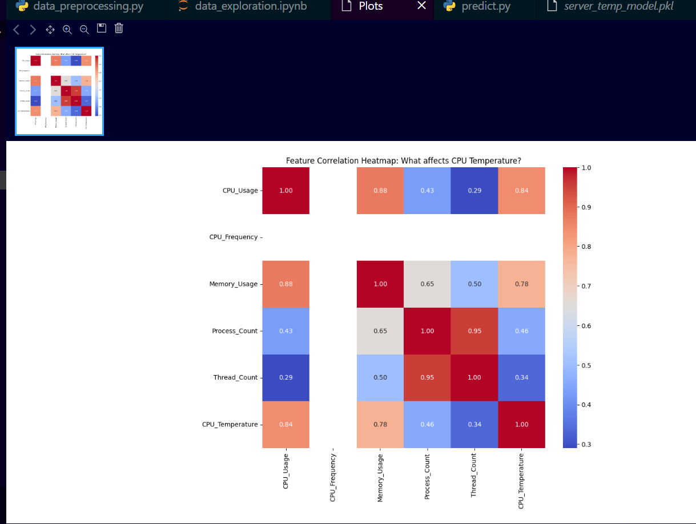
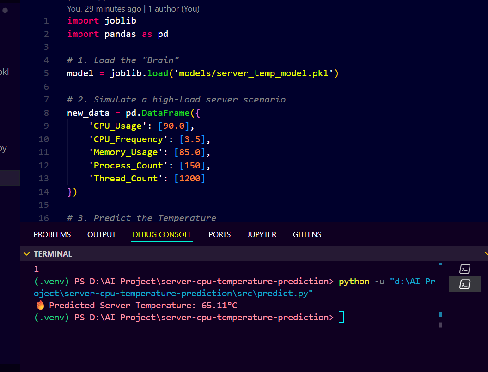
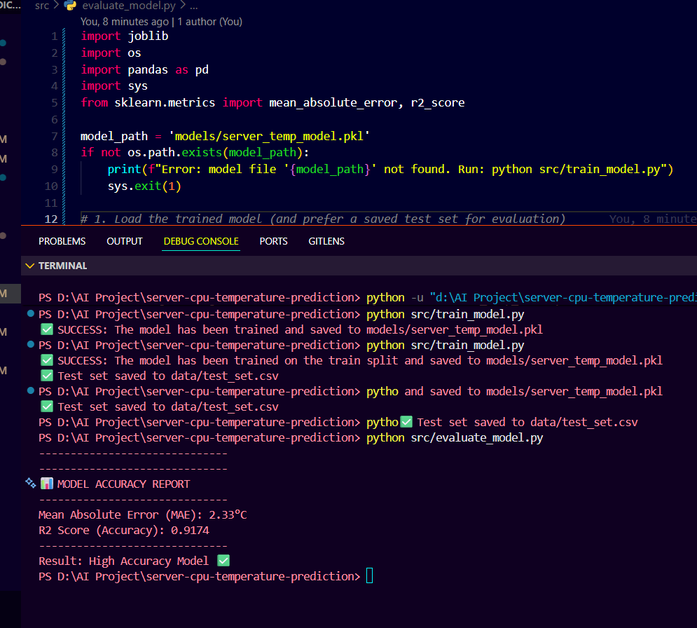

# 📊 Project Results and Performance Metrics

### 1. Feature Correlation Analysis

We analyzed the statistical relationship between hardware variables and thermal output.

* **Primary Driver**: CPU Usage shows a **0.84 correlation** with temperature.
* **Secondary Driver**: Memory Usage maintains a high **0.78 correlation**.

### 2. Live Model Verification

The model was tested using a simulated high-load environment to verify accuracy.

* **Test Scenario**: 90% CPU Load and 85% Memory Utilization.
* **AI Forecast**: Predicted Server Temperature of **65.11°C**.

---

## Model Evaluation (held-out test set)

- **Model**: Random Forest Regressor (saved as `models/server_temp_model.pkl`)
- **Test set**: `data/test_set.csv` (saved during training)
- **Mean Absolute Error (MAE)**: **2.33°C**
- **R² Score**: **0.9174**

Screenshot: evaluation console screenshot is included at `docs/model_accuracy_report.png` and shown below:

---

## Final Metrics (confirmed)

- **Mean Absolute Error (MAE)**: **2.33°C**
- **R² Score**: **0.9174**

These are calculated on the held-out `data/test_set.csv` saved during training.
